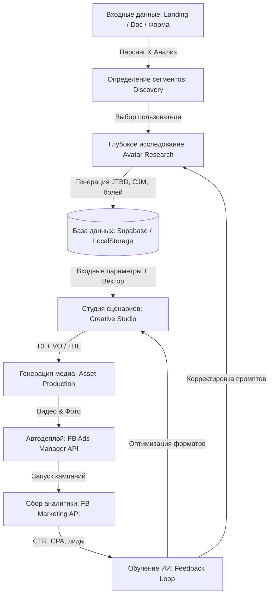

# A-to-A (Avatar-to-Ads): Системная архитектура и бизнес-логика

Этот документ подробно описывает логику работы, архитектуру данных и сквозные процессы платформы **A-to-A**. Предназначен для разработчиков, системных архитекторов и продуктовых менеджеров для быстрого онбординга в проект.

---

## 1. Сквозная концепция платформы
**A-to-A** — это инструмент автоматизации маркетингового цикла полного хода (End-to-End). Его ключевая концепция — **data-driven креатив**. Платформа связывает воедино этапы от анализа продукта до закупки рекламы и обучения на ее результатах.



---

## 2. Архитектура данных и стек технологий

### Технологический стек:
*   **Frontend**: Next.js 15+ (App Router), React, Tailwind CSS / Vanilla CSS, Lucide Icons.
*   **Backend**: Next.js API Routes (Serverless-функции).
*   **База данных**: Supabase (PostgreSQL) с авторизацией через cookies.
*   **ИИ-движок**: Google Gemini API (модель Gemini 2.5 Flash / Pro).
*   **Внешние интеграции**: Google Docs API, Puppeteer (парсер сайтов), FB Graph API.

---

## 3. Схема базы данных (Supabase)

Основная таблица — `projects`. Все сложные структуры исследований хранятся в формате JSONB для гибкости и скорости разработки.

### Структура таблицы `projects`:

| Колонка | Тип данных | Описание |
| :--- | :--- | :--- |
| `id` | UUID (PK) | Уникальный идентификатор проекта |
| `name` | TEXT | Название продукта или компании |
| `status` | TEXT | Текущий статус проекта (`avatars_ready`, `done`) |
| `created_at` | TIMESTAMPTZ | Время создания проекта |
| `brief` | JSONB | Конфигурация брифа (продукт, ГЕО, целевая, а также архив сценариев `scripts`) |
| `avatars` | JSONB | Массив сгенерированных аватаров и результатов исследования |

### JSON-схема одного Аватара (`avatars` array):
```json
{
  "segmentName": "Название сегмента",
  "summary": "Краткое резюме сегмента",
  "portrait": "Психологический портрет",
  "jtbd": [
    { "job": "Что хочет сделать клиент", "context": "В каких условиях" }
  ],
  "pains": [
    { "pain": "Боль клиента", "context": "Контекст боли", "frequency_rating": 5 }
  ],
  "fears": [
    { "fear": "Страх клиента", "context": "Контекст страха", "frequency_rating": 4 }
  ],
  "symptoms": [
    { "symptom": "Как проявляется боль в жизни", "context": "Пример", "frequency_rating": 5 }
  ],
  "behaviorMarkers": [
    { "marker": "Поведенческий маркер", "context": "Где и как себя ведет" }
  ],
  "motivations": [
    { "motivation": "Что мотивирует купить", "context": "Контекст" }
  ],
  "objections": [
    { "objection": "Возражение против покупки", "context": "Как отразить" }
  ],
  "cjm": [
    { "title": "Сценарий 1", "scenario": "Полное описание шагов клиента" }
  ]
}
```

---

## 4. Подробная логика этапов

### ЭТАП 1: Парсинг и формирование контекста (Ingestion)
При создании проекта система собирает первичный бриф.
*   **Сайт (Landing Page)**: Серверная функция принимает URL, запускает парсер (или выполняет HTTP-запрос к HTML), очищает разметку от скриптов и стилей, вытаскивая только полезный текст.
*   **Google Doc**: Загрузчик считывает контент документа через Google Drive API.
*   **Результат**: Чистый текстовый контекст продукта передается на этап Discovery.

### ЭТАП 2: Поиск сегментов (Discovery)
На этом этапе ИИ решает задачу классификации:
1.  Контекст отправляется в Gemini API с промптом: *«Проанализируй продукт и выдели до 10 уникальных сегментов целевой аудитории по методологии JTBD»*.
2.  ИИ возвращает массив сегментов. Пользователь видит их в интерфейсе в виде интерактивных карточек.
3.  Пользователь может вручную добавить новые сегменты или отредактировать предложенные. Затем он выбирает нужные для глубокого анализа.

### ЭТАП 3: Глубокое исследование (Avatar Research)
Для каждого выбранного сегмента запускается параллельный пул запросов к Gemini API.
*   **Запрос**: ИИ получает бриф продукта + конкретное название сегмента. Промпт требует разложить этот сегмент по полочкам: от глубинных болей до конкретных CJM (карт пути клиента).
*   **JSON-mode**: Gemini API принудительно возвращает строго валидный JSON по заданной схеме. Это гарантирует, что фронтенд сможет без ошибок отрендерить звездные рейтинги и списки.
*   **Рейтинги**: Каждому пункту болей/страхов ИИ присваивает `frequency_rating` (от 1 до 5 звезд) на основе маркетинговой оценки частоты проявления этой боли.

### ЭТАП 4: Студия сценариев (Creative Studio)
Пользователь выбирает аватар и формат рекламы (например, видео-креатив).
*   **Направление ИИ (Focus Direction)**: Пользователь может задать ручной вектор генерации (например, *«фокусируйся на боли о нехватке времени по вечерам»*). ИИ берет этот вектор, находит соответствующий пункт в массиве `pains` выбранного аватара и строит сценарий вокруг него.
*   **Разделение VO/TBE**: Сценарий генерируется в виде таблицы, где строго разделены закадровый голос (`VO` — Voice Over) и текст на экране (`TBE` — Text Beside Elements). Это исключает дублирование аудио и видео-ряда.

### ЭТАП 5: Производство медиа-файлов (Asset Production) *(В разработке)*
Используя сгенерированный сценарий:
*   Система передает ТЗ в API генераторов видео/картинок (например, Runway, Midjourney, Stable Diffusion).
*   Формируется архив готовых видеороликов и картинок с наложенным текстом (TBE).

### ЭТАП 6: Деплой в Facebook Ads (Deployment) *(В разработке)*
*   Платформа авторизует пользователя через OAuth в Facebook.
*   Через API FB Ads Manager создается рекламная кампания.
*   Готовые медиа-файлы загружаются в Creative Library.
*   Автоматически формируются Ad Sets (группы объявлений), таргетированные на аудиторию, соответствующую описанию аватаров, с подстановкой сгенерированных текстов.

### ЭТАП 7: Обратная связь и аналитика (Feedback Loop) *(В разработке)*
Раз в сутки система запрашивает результаты работы рекламы по API:
1.  Подтягиваются метрики: ID креатива -> CTR (кликабельность), CPC (цена клика), CPL (цена лида).
2.  Данные передаются аналитическому ИИ-агенту. Он сопоставляет: *«Креатив №5 имел CTR 4.5% на сегменте "Офисные работники". Этот креатив бил в Боль №2 (выгорание) и использовал Дружелюбный тон»*.
3.  ИИ делает вывод: для сегмента "Офисные работники" боль "выгорание" работает на 40% лучше, чем боль "низкая зарплата".
4.  В базе данных обновляются веса (приоритеты) болей аватара. При следующей генерации сценариев для этого сегмента ИИ автоматически выдвинет наиболее конвертящие боли на первый план.

---

## 5. Механика синхронизации: Local-First + Cloud

Для обеспечения мгновенного отклика интерфейса и надежного хранения реализована гибридная схема:

1.  **Локальный буфер (LocalStorage)**:
    *   Все промежуточные шаги генерации, черновики сценариев и временные аватары пишутся в `localStorage` под ключами `projectScripts_${projectId}` и `tempBrief`.
    *   Это защищает пользователя от потери данных при обрыве связи или перезагрузке страницы.
2.  **Облачная база (Supabase)**:
    *   При создании проекта или ручном нажатии кнопки «Синхронизация» локальный массив сценариев отправляется POST/PUT запросом на `/api/projects`.
    *   Сервер делает `.update({ brief: updatedBrief })` в Supabase.
3.  **Слияние при загрузке (Merge Logic)**:
    *   При открытии проекта скрипты загружаются одновременно из локального хранилища и из базы данных.
    *   Они объединяются в один массив с помощью JavaScript-коллекции `Map` по уникальному `id` сценария (исключая дубликаты), сортируются по дате создания и сохраняются обратно в `localStorage`, обновляя кэш браузера.
