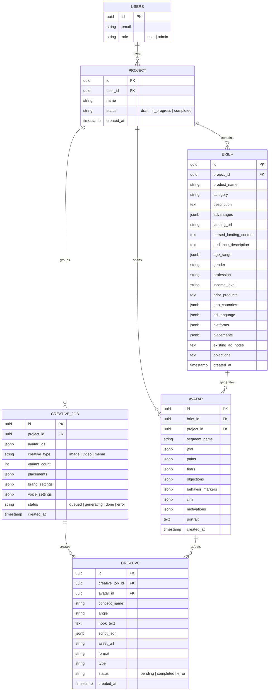

# Avatar-to-ADS: Техническое проектирование MVP

Этот документ содержит полную техническую спецификацию для реализации MVP сервиса Avatar-to-ADS, включая архитектуру БД, пайплайны генерации, интеграции и поэтапный план разработки.

## 1. Схема базы данных (Supabase Postgres)

> [!NOTE]
> Схема спроектирована с учетом Row Level Security (RLS) в Supabase. Пользователи видят только свои проекты, а доступ к таблице `avatars` ограничен подсистемой ролей (user/admin).



## 2. Архитектура AI-пайплайна (Входы и Выходы)

Процесс представляет собой цепочку вызовов к LLM, где каждый шаг обогащает итоговый контекст.

### Этап 1: Сегментация (Генерация 아ватар)
* **Вход:** Данные `Brief` (JSON) + распарсенный лендинг.
* **Системный промпт:** «Prompt JTBD Аудитория Сегментирование» (предоставлен).
* **Формат вывода (JSON из LLM):**
  ```json
  {
    "segments": [
      {
        "segmentName": "string",
        "jtbd": [{"job": "string", "context": "string"}],
        "pains": [{"pain": "string", "frequency_rating": 10}],
        "fears": [], "objections": [], "behaviorMarkers": [],
        "cjm": [], "motivations": [], "portrait": "string"
      }
    ]
  }
  ```

### Этап 2: Генерация базы креатива (например, Картинки)
* **Вход:** Выбранный `Avatar` + продукт из `Brief` + `placements`.
* **Промпт:** «Генерация креативов реклама».
* **Формат вывода (JSON):**
  ```json
  {
    "hook": "string",
    "pain": "string",
    "solution": "string",
    "cta": "string",
    "designBrief": "description of visual elements"
  }
  ```

### Этап 3 (Видео): Генерация сценария (Timeline)
* **Формат вывода (JSON):**
  ```json
  {
    "scenes": [
      {
        "timestamp": "00:00 - 00:03",
        "duration": 3.0,
        "voText": "Привет! Устал от...",
        "visualDesc": "close up of a stressed out person working on laptop"
      }
    ]
  }
  ```

## 3. Интеграции с внешними API

| Сервис | Использование | Формат запроса | Формат ответа |
| :--- | :--- | :--- | :--- |
| **Cheerio / Firecrawl** | Скрапинг лендингов | `GET` с `url` лендинга | HTML текст / очищенный Markdown |
| **OpenAI (GPT-4o)** | Текстовая аналитика, JSON-сценарии | `POST /v1/chat/completions` (с `response_format: { type: "json_object" }`) | JSON с данными сегментов/сценария |
| **Pexels API** | Поиск стоковых видео | `GET /videos/search?query=visualDesc&per_page=1` | Array of video objects (содержит ссылки на mp4) |
| **Kling AI API** | Поиск/генерация видео | `POST /api/v1/generate` (зависит от конкретной реализации Kling) | `video_url` |
| **OpenAI TTS** | Закадровый голос | `POST /v1/audio/speech` (текст, модель "tts-1", голос) | Бинарный аудио-поток (`.mp3` или `.wav`) |
| **Orshot API** | Изображения / Картинки | `POST /api/v1/render` с JSON-моделью слоев | Ссылка на отрендеренный JPG/PNG |
| **Imgflip API** | Генерация мемов | `POST /caption_image` (`template_id`, `text0`, `text1`) | `{ "success": true, "data": { "url": "..." } }` |

## 4. Интерфейс (Описания экранов)

1. **Шаг 0 — Дашборд**: Сетка с карточками проектов. Каждая карточка показывает статус. Кнопка "Новый проект". Верхний навбар для настроек профиля. 
2. **Шаг 1 — Бриф**: Длинная форма разбитая на секции A, B, C, D логическими блоками (карточками). 
   - **Индикатор**: Попап или оверлей с прогресс-баром при генерации (анализируем/парсим/сегментируем).
   - **Карточки аватаров**: Компактные превью с выжимкой, без детальных JTBD (они скрыты для роли `user`).
3. **Шаг 2 — Настройки**: Панель инструментов слева, превью форматов справа. Матрица доступности гасит радиобаттоны неподходящих форматов для выбранных площадок.
4. **Шаг 3 — Результаты**: Сетка Pinterest-style или Masonry с полученными медиа-файлами. Кнопки `Play`, `Download`, `Edit`.
5. **Шаг 4 — Доработка**: Модальное окно или сайд-панель: быстрая смена текстов оверлея или полный реролл сценария на базе другого сегмента.

## 5. Логика сборки видео (FFmpeg Pipeline)

> [!WARNING]
> Vercel Serverless Functions и Supabase Edge Functions **НЕ ПОДДЕРЖИВАЮТ** запуск полноценного бинарника FFmpeg и долгие процессы (лимит ~10-60 сек на выполнение). Для пункта 6 потребуется микро-воркер (на Node.js/Python на Render, Railway, DigitalOcean) для видеорендера, или облачный API.

**Если мы используем выделенный воркер (Background worker):**

1. **Сбор медиа (Скачивание):**
   - Скачиваются стоковые видео (из Pexels/Kling).
   - Скачиваются аудиофайлы (OpenAI TTS) для каждой сцены `[audio_1, audio_2]`.
2. **Абсолютный монтаж (Подгонка):**
   - Видеоряд подрезается или зацикливается под длину TTS-аудио.
   - *Команда:* `ffmpeg -i video1.mp4 -i audio1.mp3 -c:v copy -c:a aac -t <длина_аудио> scene1.mp4`
3. **Склейка (Concat):**
   - `ffmpeg -f concat -i file_list.txt -c copy full_silent.mp4`
4. **Субтитры (Оверлей):**
   - Формируется файл `.srt` или `.ass` из `voText` и таймкодов (можно сразу стилизовать кириллической типографикой).
   - *Финальный рендер:* `ffmpeg -i full_silent.mp4 -vf "subtitles=subs.srt" -c:a copy final_output.mp4`
5. Загрузка в **Supabase Storage** и обновление БД.

## 6. Ограничения MVP и Фичи "Версии 2.0"

### Ограничения MVP
- В MVP нет встроенного React-редактора видео / таймлайнов (timeline editor). Шаг 4 - это просто повторная кодогенерация или мелкие текстовые замены.
- TTS синхронизация (Lip Sync) или сложная анимация текста ("караоке", как в CapCut) делается базовыми средствами FFmpeg без покадрового трекинга лиц.
- Лимиты площадок ложатся на плечи внешних API ($0.04-0.10 за генерацию – оплата со своего кармана до внедрения биллинга, поэтому нужна система защиты роутов).
- Нет контроля Brand Voice.

### Для Версии 2.0
- Аватары: платная фича для раскрытия всех JTBD/Болей клиенту.
- Интеграция по OAuth с FB Manager / TikTok Ads для прямой отправки в кампании.
- Продвинутые видео-шаблоны через Remotion вместо сырого FFmpeg.
- Мультиязычный интерфейс и система команд.

## 🚀 Предложение по этапам разработки

Да, разработку нужно разбить на этапы. Предлагаю такой план:

### Этап 1: Инфраструктура и Интерфейс (Основа)
- Инициализация `Next.js` на порту `5177`.
- Подключение `Supabase` (таблицы, RLS, Auth).
- Верстка дашборда и всех 4 шагов фронтенда (на моках данных).

### Этап 2: Бриф, Парсинг и Аватары (Ядро логики)
- Интеграция парсера лендингов (Cheerio).
- Подключение OpenAI API для процесса Сегментации.
- Сохранение Аватаров в БД и отображение прогресса воронки.

### Этап 3: Графика и Мемы (Быстрые креативы)
- Подключение Imgflip API и Orshot API.
- Реализация генератора статики и мемов в БД и UI.
- Возможность скачивания PNG-результатов.

### Этап 4: Видео пайплайн FFMPEG (Самая сложная часть)
- Создание микро-сервиса (или воркера) для FFmpeg пайплайна.
- Интеграции Pexels, Kiling AI и OpenAI TTS.
- Сшивка, наложение субтитров и загрузка финального медиа в Supabase Storage.

> [!IMPORTANT]
> Если этот план вас устраивает, мы можем начать прямо сейчас с **Этапа 1**. Жду вашего одобрения для разворачивания Next.js и генерации локального окружения!
